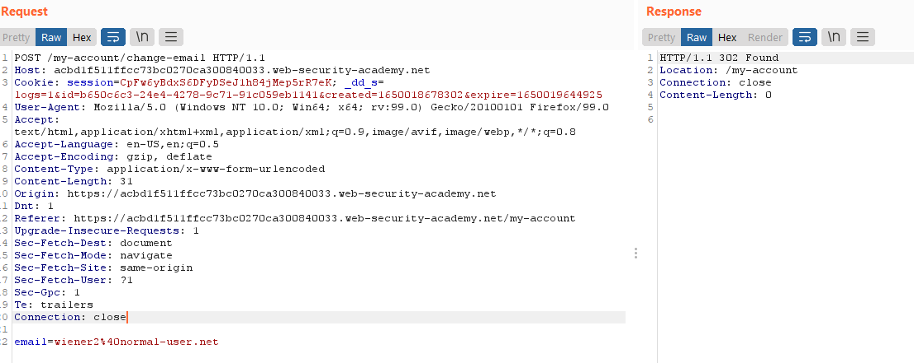
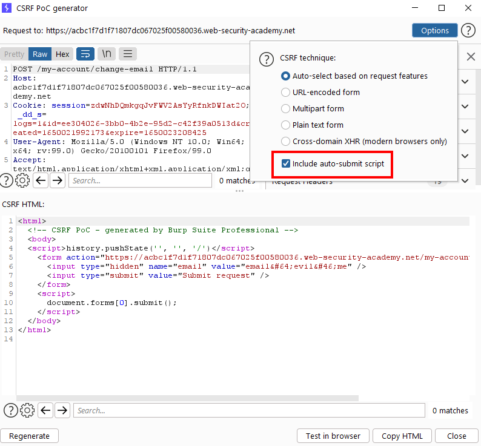
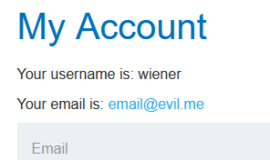

# Lab: CSRF vulnerability with no defenses

Lab-Link: <https://portswigger.net/web-security/csrf/lab-no-defenses>  
Difficulty: APPRENTICE   

## Known information

- Lab application contains a email change feature vulnerable to CSRF
- Goals:
  - Create some HTML to change a viewers email address
  - Known good credentials `wiener:peter`

## Steps

The first step is an analysis of the web application in question, in this case the good old trusty blog website. I want to change the email address of a user, so I go straight to the account overview of `wiener` with the credentials provided.

There, I change his email address and have a look at the request in Burp:

It appears that the request relies on the session cookie to identify the account with no additional feature to safeguard against some malicious activity.

So I just have to create a form that resembles the original form and auto-submits when the page is viewed. Thanks to web technology, I can just copy'n'paste the original form to have a base.

I need to update the `action` to point to the targetted server (the lab application) as well as hardcode my email address. On top of that I add a JavaScript that automatically submits the form so that the user does not have to manually click on any button (usability plays a big role here):

In Burp Suite Pro, the creation of this form can be done easily with the PoC generator by right-clicking on the email change request from the history and selecting `Engagement tools > Generate CSRF PoC`:

Testing the exploit by clicking on `View exploit` results in me being redirected to my account page:

All that is left is to click on `Deliver exploit to victim` to solve the lab.

